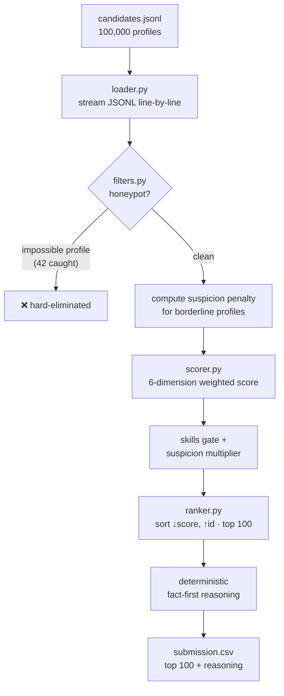
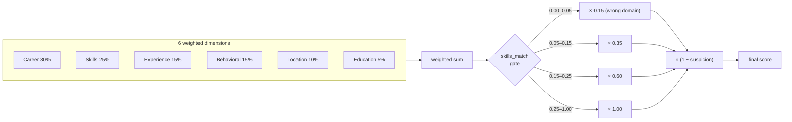
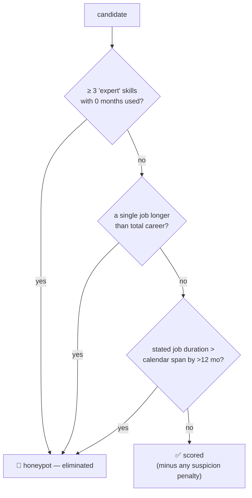

# 🍪 Biscuit — Intelligent Candidate Ranking System

> A deterministic, **CPU-only, zero-dependency** candidate ranking engine for the **Redrob AI "India Runs" Data & AI Challenge**. Ranks the top 100 candidates from a 100,000-profile pool against a Senior AI Engineer job description — in **well under a minute** (≈10 s in isolated Docker), with fact-grounded reasoning for every pick.

**Reproduce command:** `python rank.py --candidates ./candidates.jsonl --out ./submission.csv`

---

## ✨ Highlights

| | |
|---|---|
| ⚡ **Fast** | Full 100K pool ranked in **under 30 s** (~10 s in isolated Docker; limit: 5 min) |
| 🧠 **Zero dependencies** | Pure Python **standard library** — no pandas, no numpy, no LLM calls |
| 🔁 **Deterministic** | Byte-identical output across runs (MD5-seeded, not `hash()`) |
| 🛡️ **Honeypot-safe** | **0** honeypots, **0** pure-consulting, **0** ghost profiles in the top 100 |
| 📝 **Explainable** | A unique, fact-grounded reasoning sentence for every one of the 100 picks |
| 🔌 **Offline** | No network, no GPU — runs unchanged in a sealed Docker container |

---

## 🎯 The Problem

Rank the **top 100** candidates from a **100,000-profile pool** for a *Senior AI Engineer (Founding Team)* role at Redrob AI, under strict compute limits (≤5 min, ≤16 GB, CPU-only, no network), with a 1–2 sentence justification per candidate.

The dataset is adversarial by design — it contains **keyword stuffers**, **plain-language strong candidates who use no buzzwords**, **behavioral twins**, and **~80 honeypots** with subtly impossible profiles. The "right answer" is *not* "whoever lists the most AI keywords" — it requires reasoning about the gap between what the JD **says** and what it **means**.

---

## 🏗️ Pipeline Architecture



`100,000 loaded → 42 honeypots removed → 99,958 scored → top 100 written.`

---

## 📁 Project Structure

```
biscuit-candidate-ranker/
├── rank.py                  # Entry point — load → filter → score → rank → CSV
├── validate_submission.py   # CSV format validator (spec sections 2–3)
├── requirements.txt         # (empty — pure stdlib)
├── Dockerfile               # Sealed CPU-only reproduction environment
├── submission_metadata.yaml # Portal metadata mirror
├── src/
│   ├── loader.py            # Memory-efficient streaming JSONL/JSON loader
│   ├── filters.py           # Honeypot hard-filter + suspicion scoring
│   ├── scorer.py            # 6-dimension weighted scoring engine
│   ├── ranker.py            # Sort, top-N, deterministic reasoning
│   └── config.py            # JD-derived weights, skill sets, thresholds
├── sandbox/
│   └── sandbox_notebook.ipynb   # Colab end-to-end demo on a sample
├── docs/
│   ├── submission_deck.html        # Presentation deck source (→ PDF below)
│   └── Biscuit_Submission_Deck.pdf  # Rendered 9-page deck
└── data/
    └── sample_candidates.json   # 50-candidate sample for quick runs
```

---

## 🚀 Quick Start

```bash
# 1. (No-op — Biscuit has zero third-party dependencies, but kept for convention)
pip install -r requirements.txt

# 2. Run on the 50-candidate sample
python rank.py --candidates ./data/sample_candidates.json --out ./sample_out.csv --top-n 50

# 3. Run on the full 100K dataset (THE reproduce command)
python rank.py --candidates ./candidates.jsonl --out ./submission.csv

# 4. Validate the output against the spec
python validate_submission.py submission.csv
```

> **Python alias note:** if your machine only exposes Python 3 as `python3`, use that. The Docker image and Colab sandbox use `python`.

> **Submitted file:** the reproduce command outputs `submission.csv`. The file uploaded to the portal is **`Biscuit.csv`** — a **byte-identical** copy renamed to our team ID (per the spec's `<participant_id>.csv` filename rule). Both are committed so the exact submitted artifact is traceable in the repo; verify with `diff submission.csv Biscuit.csv` (no differences).

---

## ✅ Compute Compliance (Stage 3)

The ranking step is reproducible inside a sealed Docker container matching the challenge limits exactly:

| Constraint | Limit | Biscuit | ✓ |
|---|---|---|---|
| Runtime (full 100K) | ≤ 5 min | **< 30 s** (~10 s in Docker) | ✅ |
| Memory (peak RSS) | ≤ 16 GB | **~2 GB** | ✅ |
| Compute | CPU only | CPU only | ✅ |
| Network | off | **zero** network calls | ✅ |
| Dependencies | — | **0** third-party packages | ✅ |
| Pre-computation | — | **none required** | ✅ |

No embeddings to precompute, no model weights to download, no index to build — the ranking is the only step.

---

## 🧮 Scoring Model

Each candidate is scored on **six JD-derived dimensions**, normalized to `[0, 1]`, then combined by weighted sum:

| Dimension | Weight | What it measures |
|---|---:|---|
| **Career relevance** | **30%** | Product- vs services-company tenure, ML/AI titles, shipped-system language in descriptions |
| **Skills match** | **25%** | Core IR/NLP/retrieval skills (proficiency-weighted), with keyword-stuffer & negative-domain penalties |
| **Experience band** | **15%** | Smooth curve, flat peak across the JD's ideal **6–8 year** band |
| **Behavioral signals** | **15%** | Activity recency, recruiter response rate, completeness, GitHub, availability |
| **Location & logistics** | **10%** | India/Pune/Noida preference, notice period, work-mode fit |
| **Education** | **5%** | Institution tier and field relevance |



**Key scoring decisions:**

- **Skills gate.** A candidate with near-zero relevant ML/IR skills is *capped*, so a "Graphic Designer at Wipro" with great location/engagement can't outrank a real ML engineer. Relevance is the precondition, not just one term in a sum.
- **Consulting is a penalty, not a filter.** Pure services-only careers (TCS/Infosys/Wipro/…) are heavily down-weighted, but a **mixed** career (e.g. *TCS → product startup*) gets proportional credit — exactly as the JD describes.
- **Robust YoE.** When self-reported years diverge from the sum of dated career history by >1.5 yr, we trust the career-history sum — defeating self-reported padding.
- **Availability matters.** Per the JD, a perfect-on-paper candidate who hasn't logged in for 6 months or has a 5% recruiter response rate is *not actually hireable* and is down-weighted.

---

## 🛡️ Honeypot & Integrity Filters

The dataset embeds ~80 honeypots — profiles that are "perfect on paper" but **subtly impossible**. Three deterministic rules hard-eliminate the definitively-impossible ones (**42 caught**); softer inconsistencies become a graded *suspicion* penalty rather than a death sentence.



The rules are intentionally conservative (zero false positives — every one of the 42 is a genuinely impossible, non-ML profile such as a *Mobile Developer* claiming 3 expert skills with 0 months, or a *Frontend Engineer* with a single job longer than their whole career). We do **not** special-case honeypots beyond these impossibility checks; the scoring naturally avoids the rest.

---

## 📝 Reasoning Generation

Every candidate gets a **unique, fact-grounded** justification built only from real profile fields (years, current role, named skills, product companies, education, honest concerns). No generative text, so **zero hallucination** and full determinism:

- A per-candidate seed = `int(hashlib.md5(candidate_id).hexdigest()[:8], 16)` (not Python's `hash()`, which is salted across processes) drives sentence-template variation — so the *same* candidate always gets the *same* reasoning, but different candidates read differently (no templated repetition).
- Strong facts (skills, career, shipped-system evidence) lead; weaker facts (location, notice) support; genuine concerns (long notice, junior YoE, low engagement) are stated honestly so the tone matches the rank.

---

## 🔬 Validation & Methodology

Because the challenge has **no public leaderboard** and is scored against **hidden labels**, the approach was validated by *methodology*, not by submitting variants:

- **Top-100 sanity:** 0 honeypots, 0 pure-consulting-only careers, 0 ghosts (<10% recruiter response); median **6.45 YoE**, median **5 core JD skills** — every top-10 pick shows concrete *shipped* retrieval/ranking/search/recsys experience.
- **Calibration sweep:** an independent blind review across the full rank spectrum confirmed quality falls off a sharp cliff right after rank 100 and bottoms out (irrelevant non-ML roles) in the deep ranks — i.e. the scorer orders the *entire* pool correctly, not just the top.
- **Honeypot audit:** all 42 hard-removed profiles were re-checked — zero false positives.
- **Improvement testing:** a skill-synonym recall fix and a semantic (TF-IDF) hybrid were prototyped and measured; both were a statistical wash, so the simpler, more defensible baseline was kept rather than overfit.

---

## 🐳 Docker

```bash
docker build -t biscuit .

# Mount the directory containing candidates.jsonl into /app/
docker run -v "$(pwd)":/app biscuit

# …or mount just the data file:
# docker run -v /path/to/candidates.jsonl:/app/candidates.jsonl biscuit
```

The default `CMD` runs the exact reproduce command. The image is `python:3.11-slim` with **no extra pip installs** — it builds and runs unmodified.

---

## 🧪 Sandbox / Demo

A Google Colab notebook runs the full pipeline end-to-end on the 50-candidate sample, verifies the output format, and checks determinism:

- **[sandbox/sandbox_notebook.ipynb](sandbox/sandbox_notebook.ipynb)** — open in Colab via the link in `submission_metadata.yaml`.

---

## 🖥️ Presentation Deck

The presentation explaining our approach, architecture, and design decisions:

- **[docs/Biscuit_Submission_Deck.pdf](docs/Biscuit_Submission_Deck.pdf)** — the rendered 9-page deck (source: `docs/submission_deck.html`).

To regenerate the PDF: open `docs/submission_deck.html` in Chrome → `Cmd/Ctrl + P` → *Save as PDF*, **Landscape**, **Background graphics** on. (`docs/blueprint.html` is an earlier interactive version.)

---

## 👥 Team

- **Team Name:** Biscuit
- **Submission for:** Redrob AI "India Runs" Data & AI Challenge
- See [`submission_metadata.yaml`](submission_metadata.yaml) for full contact and AI-tool declarations.
